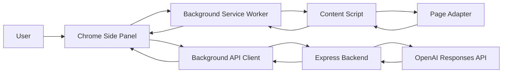
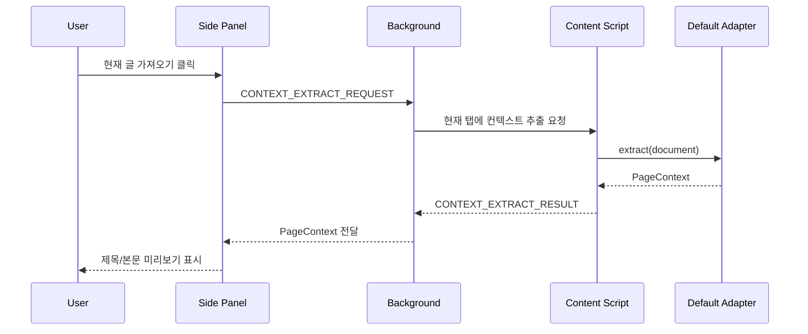
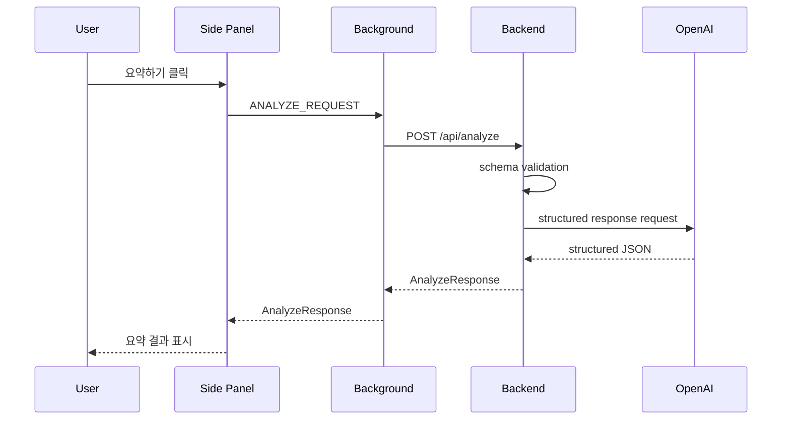
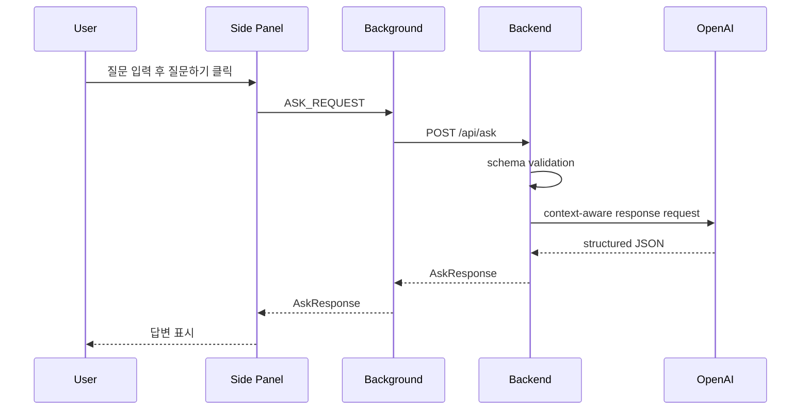

# Thread Wise Architecture

이 문서는 1차 MVP 기준의 Chrome Extension과 Node.js 백엔드 구조를 정의한다.

1차 MVP의 제품 범위는 현재 페이지의 게시글 내용을 추출해 요약하거나 질문하는 기능이다. 사실 검증용 웹 검색, 댓글 추천, 댓글 다듬기, 댓글 입력창 삽입은 후속 MVP에서 다룬다.

## 1. 시스템 개요



역할 분리:

```text
Side Panel: 사용자 UI와 사용자 명령 처리
Background Service Worker: 현재 탭 확인, 메시지 라우팅, 백엔드 API 호출 중계
Content Script: 현재 페이지 DOM 접근과 컨텍스트 추출
Page Adapter: 사이트별 또는 기본 본문 추출 전략
Backend: 요청 검증, OpenAI 호출, 응답 구조화, 로그 최소화
OpenAI: 요약과 질문 응답 생성
```

## 2. 1차 MVP 핵심 흐름

### 2.1 현재 글 가져오기



중요한 안전 기준:

```text
이 단계에서는 서버로 원문을 보내지 않는다.
추출된 본문은 사용자가 Side Panel에서 확인할 수 있게 한다.
추출 실패는 숨기지 않고 경고로 표시한다.
```

### 2.2 요약하기



### 2.3 질문하기



## 3. Extension 구조

권장 구조:

```text
extension/
  manifest.json
  package.json
  vite.config.ts
  tsconfig.json
  src/
    background/
      serviceWorker.ts
      apiClient.ts
      tabContext.ts
    content/
      index.ts
      adapters/
        types.ts
        defaultAdapter.ts
        adapterRegistry.ts
    sidepanel/
      main.tsx
      App.tsx
      pages/
        ReadPage.tsx
      components/
        ContextPreview.tsx
        AskBox.tsx
        ResultPanel.tsx
        StatusBanner.tsx
    shared/
      messages.ts
      types.ts
      constants.ts
```

### 3.1 Manifest V3

필수 구성:

```text
manifest_version: 3
background.service_worker
content_scripts
side_panel
permissions
host_permissions
```

1차 MVP 권장 권한:

```text
sidePanel
activeTab
scripting
storage
```

host permissions는 개발 중 넓게 둘 수 있지만, 배포 전에는 지원 사이트 또는 `<all_urls>` 사용 사유를 명확히 검토한다.

### 3.2 Side Panel

Side Panel은 1차 MVP에서 단일 읽기 화면만 제공한다.

화면 요소:

```text
현재 글 가져오기 버튼
추출 상태 표시
제목/URL 표시
본문 미리보기
선택 텍스트 표시
요약하기 버튼
질문 입력창
질문하기 버튼
결과 영역
오류/경고 표시
```

1차 MVP에서 제외할 UI:

```text
사실 검증 탭
댓글 추천 탭
댓글 다듬기 탭
댓글 입력창 삽입 버튼
위험도 표시
```

### 3.3 Background Service Worker

책임:

```text
현재 활성 탭 조회
Side Panel과 Content Script 간 메시지 라우팅
백엔드 API 호출
서버 URL 설정값 조회
공통 오류 응답 변환
```

Background는 DOM을 직접 읽지 않는다. DOM 접근은 content script에만 맡긴다.

### 3.4 Content Script

책임:

```text
현재 페이지 URL과 title 수집
사용자 선택 텍스트 수집
게시글 제목 후보 추출
게시글 본문 후보 추출
추출 품질 경고 생성
```

Content Script는 서버와 직접 통신하지 않는다. 서버 호출은 Background를 거치도록 한다.

### 3.5 Adapter 구조

1차 MVP에서는 `defaultAdapter`만 구현한다.

Adapter 인터페이스:

```ts
type ExtractedPageContext = {
  pageUrl: string;
  pageTitle: string;
  site: string;
  postTitle: string;
  body: string;
  selectedText: string;
  extractionMethod: "default" | "selection-only" | "manual";
  extractionWarnings: string[];
};

type PageAdapter = {
  id: string;
  matches(url: URL, document: Document): boolean;
  extract(document: Document): ExtractedPageContext;
};
```

기본 추출 우선순위:

```text
article 요소
main 요소
role=main 요소
h1 주변 본문 후보
긴 텍스트 블록 후보
선택 텍스트만 사용
```

## 4. Backend 구조

권장 구조:

```text
server/
  package.json
  tsconfig.json
  .env.example
  src/
    app.ts
    server.ts
    routes/
      health.ts
      analyze.ts
      ask.ts
    schemas/
      analyze.schema.ts
      ask.schema.ts
      common.schema.ts
    services/
      openaiClient.ts
      postAnalysisService.ts
      promptService.ts
      privacyService.ts
    middleware/
      errorHandler.ts
      requestLogger.ts
      rateLimit.ts
    types/
      api.ts
```

### 4.1 Routes

Route의 책임:

```text
요청 스키마 검증
서비스 호출
성공 응답 반환
도메인 에러를 공통 에러 형식으로 전달
```

Route에서 직접 OpenAI SDK를 호출하지 않는다.

### 4.2 Services

`postAnalysisService`:

```text
게시글 요약
게시글 기반 질문 응답
본문 길이 제한 적용
OpenAI 응답 후처리
```

`promptService`:

```text
공통 시스템 지시문 생성
요약 프롬프트 생성
질문 응답 프롬프트 생성
```

`openaiClient`:

```text
OpenAI SDK 초기화
Responses API 호출
Structured Outputs 스키마 적용
타임아웃과 오류 변환
```

`privacyService`:

```text
로그용 메타데이터 생성
본문/질문 원문 로그 차단
요청 크기와 잘림 여부 계산
```

### 4.3 Middleware

필수 미들웨어:

```text
JSON body limit
request id 부여
request logger
rate limit
error handler
CORS 제한
```

## 5. API 호출 경계

Extension:

```text
OpenAI API 직접 호출 금지
API Key 저장 금지
게시글 원문을 extension storage에 영구 저장 금지
사용자 클릭 전 서버 전송 금지
```

Backend:

```text
OpenAI API Key 환경변수 관리
원문 DB 저장 금지
원문 로그 금지
요청 크기 제한
구조화 응답 반환
```

## 6. 데이터 저장 정책

1차 MVP에서는 DB를 사용하지 않는다.

Extension local storage에 저장 가능한 값:

```text
서버 Base URL
UI 설정
마지막 사용 탭 상태의 비민감 메타데이터
```

저장하지 않을 값:

```text
게시글 본문
선택 텍스트
사용자 질문
OpenAI 응답 전문
댓글 입력 내용
```

## 7. 에러 처리 전략

Side Panel에서 구분해야 하는 오류:

```text
본문 추출 실패
서버 연결 실패
서버 validation 실패
요청 크기 초과
rate limit 초과
OpenAI 호출 실패
알 수 없는 오류
```

서버는 모든 오류를 `ErrorResponse`로 변환한다. Extension은 사용자에게 짧고 행동 가능한 메시지로 표시한다.

## 8. 후속 확장 지점

2차 MVP 확장:

```text
factCheckService 추가
Web Search Tool 사용
출처 구조화 타입 추가
/api/fact-check 추가
검증 탭 추가
```

3차 MVP 확장:

```text
commentService 추가
moderationService 추가
/api/comment/suggest 추가
/api/comment/rewrite 추가
/api/moderate 추가
댓글 탭과 다듬기 탭 추가
댓글 입력창 삽입 기능 추가
```

자동 게시 기능은 어떤 MVP에서도 구현하지 않는다.
