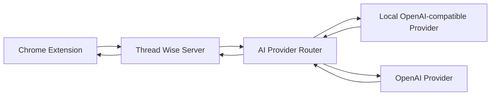

# Thread Wise Hybrid AI Plan

이 문서는 1차 MVP 완료 상태를 기준으로, API 토큰 비용을 줄이기 위해 로컬 모델과 OpenAI API 모델을 함께 사용하는 하이브리드 AI 구조를 정의한다.

현재 1차 MVP는 다음 흐름으로 동작한다.

```text
Chrome Extension
  -> Background Service Worker
  -> Thread Wise Server
  -> OpenAI Responses API
```

하이브리드 AI의 목표는 이 구조를 유지하면서 서버 내부 AI provider를 분리하는 것이다. Extension은 서버 API만 호출하고, 서버가 기능별 정책에 따라 로컬 모델 또는 OpenAI API 모델을 선택한다.

1차 하이브리드에서는 전역 AI 모드를 만들지 않는다. 먼저 비용 영향이 큰 `요약하기(/api/analyze)`에만 로컬/부스트 모드를 적용하고, `질문하기(/api/ask)`는 답변 품질을 위해 OpenAI API를 계속 사용한다.

## 1. 목표

핵심 목표:

```text
요약하기는 기본적으로 로컬 모델을 사용해 API 토큰 비용을 줄인다.
사용자가 요약 부스트를 켠 경우에만 요약에 OpenAI API 모델을 사용한다.
질문하기는 기본적으로 OpenAI API 모델을 사용해 답변 품질을 우선한다.
서버가 로컬 모델과 API 모델 사이의 라우팅과 결과 형식을 책임진다.
Extension에는 API Key를 절대 노출하지 않는다.
```

제품 포지션:

```text
요약 로컬: 비용 없음, 요약 요청의 게시글 원문을 OpenAI API로 보내지 않음, 품질은 로컬 모델 성능에 의존
요약 부스트: API 토큰 사용, 더 높은 품질과 안정적인 구조화 응답 제공
질문하기: 현재 정책에서는 항상 OpenAI API 사용
```

## 2. 비목표

이 계획에서 다루지 않는 것:

```text
Chrome Extension이 로컬 모델 또는 OpenAI API를 직접 호출하는 구조
사용자 브라우저에 API Key를 저장하는 구조
Codex를 사용자-facing 응답 엔진으로 사용하는 구조
자동 댓글 게시
사실 검증용 웹 검색까지 포함한 전체 2차 MVP 구현
로컬 모델 설치 자동화
모든 로컬 모델 런타임을 직접 지원하는 범용 어댑터
```

## 3. 시스템 구조

권장 구조:



서버 내부 책임:

```text
AI Provider Router:
  기능, 모드, 사용자 설정에 따라 provider 선택

Local Provider:
  Ollama, LM Studio, llama.cpp 등 OpenAI-compatible local endpoint 호출

OpenAI Provider:
  기존 OpenAI Responses API 호출

Pipeline:
  analyze, ask 등 기능별 프롬프트와 응답 스키마 유지
```

## 4. 모드 정의

### 4.1 Analyze Local Mode

요약하기의 목표 기본 모드이다. 이 모드는 전역 AI 모드가 아니라 `/api/analyze`에 우선 적용하는 기능별 모드이다.

```text
요약 요청에서 API 토큰을 쓰지 않는다.
요약 요청의 게시글 원문을 OpenAI API로 보내지 않는다.
로컬 모델 서버가 실행 중이어야 한다.
구조화 응답은 서버가 JSON parse와 검증으로 보정한다.
```

요약 로컬 모드 실패 시 자동으로 API로 fallback하지 않는다. 비용과 프라이버시 기대를 깨지 않기 위해 사용자의 명시적 선택이 필요하다.

중요:

```text
질문하기(/api/ask)는 이 모드의 적용 대상이 아니다.
질문하기는 현재 정책상 OpenAI API를 사용하며, UI에서 별도로 고지한다.
```

실패 UX:

```text
로컬 모델 서버에 연결할 수 없습니다.
[다시 시도] [부스트로 실행]
```

### 4.2 Analyze Boost Mode

사용자가 요약에서 명시적으로 켜는 고품질 모드이다.

```text
OpenAI API를 사용한다.
선택한 모델, 토큰 예산, 추론 강도에 따라 비용이 달라진다.
서버가 허용한 모델만 사용할 수 있다.
Structured Outputs를 우선 사용한다.
```

요약 부스트 실행 전 또는 설정 영역에 표시할 문구:

```text
요약 부스트는 API 토큰을 사용합니다. 선택한 모델과 토큰 예산에 따라 비용이 발생할 수 있습니다.
```

## 5. 기능별 Provider 정책

1차 하이브리드 기본 정책:

| 기능 | 기본 동작 | 부스트 동작 | 비고 |
| --- | --- | --- | --- |
| 현재 글 가져오기 | 모델 사용 없음 | 모델 사용 없음 | Content Script 추출만 수행 |
| 요약하기 | Local Provider 목표. 구현 초기에는 OpenAI 유지 | OpenAI Provider | 비용 절감 핵심 대상 |
| 질문하기 | OpenAI Provider | OpenAI Provider | 품질 우선. 추후 옵션화 가능 |
| 추천 질문 생성 | 요약과 동일 provider | 요약과 동일 provider | `/api/analyze` 응답에 포함되므로 요약 provider를 따른다 |
| 사실 검증 | 범위 밖 | 범위 밖 | 2차 MVP에서 별도 설계 |
| 댓글 추천/다듬기 | 범위 밖 | 범위 밖 | 3차 MVP에서 별도 설계 |

질문하기를 API로 고정하는 이유:

```text
질문은 사용자가 실제로 궁금한 내용을 직접 입력하는 고가치 요청이다.
사실성, 논쟁성, 맥락 해석이 필요한 경우가 많다.
로컬 모델이 틀린 답을 자신 있게 생성할 위험을 줄인다.
```

UI 고지 원칙:

```text
요약 로컬/부스트 선택은 요약하기에만 적용된다.
질문하기는 현재 정책에서 API를 사용한다는 문구를 질문 영역에 별도로 표시한다.
```

추후 비용 절감을 더 원하면 질문 화면에 아래처럼 분리할 수 있다.

```text
[로컬로 답변] [부스트/API로 답변]
```

## 6. 사용자 설정

Extension에서 저장할 설정:

```ts
type AnalyzeQualityMode = "local" | "boost";

type BoostPreset = "fast" | "balanced" | "high_quality" | "custom";

type TokenBudget = "low" | "normal" | "high";

type ReasoningEffort = "low" | "medium" | "high";

interface HybridSettings {
  analyzeQualityMode: AnalyzeQualityMode;
  boostPreset: BoostPreset;
  boostModel?: string;
  tokenBudget: TokenBudget;
  reasoningEffort: ReasoningEffort;
}
```

권장 기본값:

```json
{
  "analyzeQualityMode": "local",
  "boostPreset": "balanced",
  "tokenBudget": "normal",
  "reasoningEffort": "medium"
}
```

구현 초기 기본값:

```text
로컬 요약 품질 게이트를 통과하기 전까지 서버의 실제 analyze 기본 provider는 OpenAI로 유지한다.
Extension 설정 기본값은 local로 저장할 수 있지만, 서버 DEFAULT_ANALYZE_QUALITY_MODE 전환은 H3 품질 검증 후 수행한다.
```

저장 위치:

```text
chrome.storage.local
```

저장하면 안 되는 값:

```text
OpenAI API Key
로컬 모델 서버 인증 토큰
게시글 본문
사용자 질문
AI 응답 전문
```

## 7. Boost Model 선택 정책

사용자에게는 기본적으로 모델명을 직접 보여주기보다 프리셋을 제공한다.

권장 UI:

```text
요약 모드
[로컬] [부스트]

부스트 설정
모델: [빠름] [균형] [고품질] [직접 선택]
토큰 예산: [절약] [기본] [넉넉히]
추론 강도: [낮음] [보통] [높음]
```

서버 환경변수 예:

```env
BOOST_FAST_MODEL=gpt-4.1-mini
BOOST_BALANCED_MODEL=gpt-4.1
BOOST_HIGH_QUALITY_MODEL=o4-mini
BOOST_ALLOWED_MODELS=gpt-4.1-mini,gpt-4.1,o4-mini
```

보안 정책:

```text
Extension이 boostModel을 보내더라도 서버 allowlist에 없는 모델은 거부한다.
서버는 모델별 지원 기능을 확인해 reasoningEffort, maxOutputTokens 등을 적용하거나 무시한다.
허용되지 않은 모델 요청은 VALIDATION_ERROR 또는 UNSUPPORTED_MODEL로 응답한다.
```

## 8. Token Budget 정책

토큰 예산은 사용자 UX 용어와 provider 파라미터를 분리한다.

권장 매핑:

```ts
const TOKEN_BUDGETS = {
  low: {
    label: "절약",
    maxOutputTokens: 800,
  },
  normal: {
    label: "기본",
    maxOutputTokens: 1600,
  },
  high: {
    label: "넉넉히",
    maxOutputTokens: 3000,
  },
};
```

로컬 모델에도 동일한 예산 개념을 적용하되, 런타임별 파라미터 이름이 다를 수 있다.

예:

```text
OpenAI Provider: max_output_tokens 또는 대응 파라미터
OpenAI-compatible local provider: max_tokens
지원하지 않는 local runtime: 프롬프트 지시로만 반영
```

## 9. Reasoning Effort 정책

추론 강도는 요약 부스트 모드에서만 1차적으로 노출한다.

권장 매핑:

```ts
const REASONING_EFFORTS = {
  low: "low",
  medium: "medium",
  high: "high",
};
```

주의:

```text
모든 OpenAI 모델이 reasoningEffort를 지원한다고 가정하지 않는다.
서버가 모델별 capability를 판단해 지원하지 않으면 생략한다.
로컬 모델은 reasoningEffort 대신 프롬프트 지시 또는 temperature/top_p 조정으로만 반영할 수 있다.
```

## 10. API 계약 변경안

기존 `/api/analyze`와 `/api/ask` 엔드포인트는 유지한다.

### 10.1 공통 요청 확장

요약 요청에 `analyzeQualityMode`와 `boostSettings`를 추가한다.

```json
{
  "pageUrl": "https://bbs.ruliweb.com/community/board/300143/read/75272938",
  "site": "ruliweb",
  "title": "게시글 제목",
  "body": "게시글 본문",
  "selectedText": "",
  "analyzeQualityMode": "local",
  "boostSettings": {
    "preset": "balanced",
    "model": "gpt-4.1",
    "tokenBudget": "normal",
    "reasoningEffort": "medium"
  }
}
```

`analyzeQualityMode` 기본값:

```text
요청에 없으면 서버 DEFAULT_ANALYZE_QUALITY_MODE 사용
H1/H2 구현 중 서버 기본값은 openai로 유지한다.
로컬 요약 품질 게이트 통과 후 서버 기본값을 local로 전환한다.
```

### 10.2 Analyze Response 확장

응답에 실제 사용 provider 정보를 추가하는 것을 권장한다.

```json
{
  "summary": "요약",
  "mainPoints": [],
  "unknowns": [],
  "recommendedQuestions": [],
  "caution": "로컬 모델로 생성된 요약입니다.",
  "warnings": [],
  "meta": {
    "provider": "local",
    "model": "qwen3:14b",
    "analyzeQualityMode": "local"
  }
}
```

1차 구현에서는 기존 UI 호환을 위해 `meta`는 optional로 둔다.

### 10.3 Ask 정책

현재 정책상 `ask`는 기본적으로 OpenAI Provider를 사용한다.

요청에 `analyzeQualityMode: "local"`이 오더라도 `/api/ask`에는 적용하지 않는다.

```text
/api/ask:
  default provider = openai
  boostSettings가 있으면 해당 부스트 설정 사용
  추후 LOCAL_ASK_ENABLED=true일 때만 local ask 허용
  UI에는 질문하기가 API를 사용한다는 점을 별도로 고지
```

## 11. 서버 환경변수

추가할 환경변수:

```env
# Provider routing
AI_MODE=hybrid
DEFAULT_ANALYZE_QUALITY_MODE=openai
ASK_PROVIDER=openai
LOCAL_AI_ENABLED=true

# Local provider
LOCAL_AI_BASE_URL=http://localhost:11434/v1
LOCAL_AI_MODEL=qwen3:14b
LOCAL_AI_API_KEY=local-not-used
LOCAL_AI_TIMEOUT_MS=20000

# Boost provider
BOOST_FAST_MODEL=gpt-4.1-mini
BOOST_BALANCED_MODEL=gpt-4.1
BOOST_HIGH_QUALITY_MODEL=o4-mini
BOOST_ALLOWED_MODELS=gpt-4.1-mini,gpt-4.1,o4-mini
BOOST_DEFAULT_PRESET=balanced
BOOST_DEFAULT_TOKEN_BUDGET=normal
BOOST_DEFAULT_REASONING_EFFORT=medium
```

주의:

```text
LOCAL_AI_API_KEY는 OpenAI-compatible endpoint가 Authorization header를 요구할 때만 사용한다.
로컬 provider가 인증을 쓰지 않는 경우에도 코드 단순화를 위해 더미 값을 허용할 수 있다.
OPENAI_API_KEY는 기존처럼 서버 .env에만 보관한다.
```

## 12. 서버 코드 구조

권장 디렉터리:

```text
server/src/services/ai/
  aiTypes.ts
  providerRouter.ts
  localProvider.ts
  openaiProvider.ts
  modelPolicy.ts
  jsonRepair.ts

server/src/services/pipelines/
  analyzePipeline.ts
  askPipeline.ts
```

역할:

```text
aiTypes.ts:
  공통 provider 인터페이스, AnalyzeQualityMode, BoostSettings, AiProviderResult

providerRouter.ts:
  기능별 provider 선택

localProvider.ts:
  OpenAI-compatible /v1/chat/completions 호출

openaiProvider.ts:
  기존 Responses API 호출

modelPolicy.ts:
  boost preset, allowed model, token budget, reasoning effort 검증

jsonRepair.ts:
  로컬 모델 JSON 응답 parse 실패 시 1회 보정 또는 에러 변환

analyzePipeline.ts:
  요약 기능의 local/openai provider 호출과 후처리

askPipeline.ts:
  질문 기능의 openai provider 호출과 후처리
```

기존 파일 이전 방향:

```text
openaiClient.ts -> services/ai/openaiProvider.ts로 감싸거나 이동
postAnalysisService.ts -> pipelines/analyzePipeline.ts, askPipeline.ts로 분리
promptService.ts -> provider별 prompt builder를 추가하되 기존 공통 지시문은 재사용
```

## 13. Provider 인터페이스

서버 내부 공통 인터페이스 초안:

```ts
export type AiFeature = "analyze" | "ask";

export type AnalyzeQualityMode = "local" | "boost";

export type ProviderKind = "local" | "openai";

export interface BoostSettings {
  preset: "fast" | "balanced" | "high_quality" | "custom";
  model?: string;
  tokenBudget: "low" | "normal" | "high";
  reasoningEffort: "low" | "medium" | "high";
}

export interface AiRequest<TSchema> {
  feature: AiFeature;
  system: string;
  user: string;
  schemaName: string;
  schema: TSchema;
  analyzeQualityMode?: AnalyzeQualityMode;
  boostSettings?: BoostSettings;
}

export interface AiProviderMeta {
  provider: ProviderKind;
  model: string;
  // analyze 기능에만 의미가 있다. ask 응답에서는 생략한다.
  analyzeQualityMode?: AnalyzeQualityMode;
  tokenBudget?: string;
  reasoningEffort?: string;
}

export interface AiProvider {
  kind: ProviderKind;
  createStructuredResponse<T>(request: AiRequest<unknown>): Promise<{
    data: T;
    meta: AiProviderMeta;
  }>;
}
```

## 14. Local Provider 구현 정책

1차 대상은 OpenAI-compatible local endpoint이다.

권장 런타임:

```text
Ollama OpenAI-compatible API
LM Studio local server
llama.cpp llama-server
```

요청 방식:

```text
POST {LOCAL_AI_BASE_URL}/chat/completions
```

로컬 요청 예:

```json
{
  "model": "qwen3:14b",
  "messages": [
    { "role": "system", "content": "..." },
    { "role": "user", "content": "..." }
  ],
  "temperature": 0.2,
  "max_tokens": 1600
}
```

로컬 모델 구조화 응답 전략:

```text
1. system prompt에서 JSON만 출력하도록 강하게 지시한다.
2. user prompt에 JSON Schema 요약을 포함한다.
3. 서버가 JSON.parse를 수행한다.
4. 실패하면 같은 로컬 모델에 "아래 응답을 JSON으로만 고쳐라" 재시도 1회.
5. 그래도 실패하면 LOCAL_STRUCTURED_OUTPUT_ERROR 반환.
```

로컬 모델은 OpenAI Structured Outputs와 같은 안정성을 보장하지 않으므로, 서버 검증을 필수로 둔다.

## 15. OpenAI Provider 구현 정책

OpenAI Provider는 기존 1차 MVP 동작을 유지한다.

```text
Responses API 사용
Structured Outputs 사용
API Key는 서버 환경변수
본문/질문/응답 전문 로그 금지
```

요약 부스트 모드에서는 다음을 적용한다.

```text
boost preset -> model 결정
tokenBudget -> max output token 결정
reasoningEffort -> 지원 모델에만 적용
```

질문하기 기본 provider:

```text
ASK_PROVIDER=openai
```

## 16. Extension UI 변경안

Side Panel의 요약 섹션에 모드 컨트롤을 추가한다. 전역 AI 모드처럼 보이지 않게 한다.

권장 배치:

```text
요약 모드
[로컬] [부스트]

로컬 요약: 비용 없음 · 요약 요청의 게시글 원문을 API로 보내지 않음
부스트 요약: API 토큰 사용 · 더 높은 품질
```

부스트 선택 시 펼침 영역:

```text
부스트 모델
[빠름] [균형] [고품질] [직접 선택]

토큰 예산
[절약] [기본] [넉넉히]

추론 강도
[낮음] [보통] [높음]
```

요약 버튼 문구:

```text
요약 로컬: 요약하기
요약 부스트: 부스트 요약
```

질문 버튼 문구:

```text
질문하기
```

질문 영역 보조 문구:

```text
질문하기는 답변 품질을 위해 API를 사용합니다. 게시글 본문과 질문이 서버를 통해 OpenAI로 전송됩니다.
```

로컬 실패 UX:

```text
로컬 모델 서버에 연결할 수 없습니다.
[다시 시도] [부스트로 실행]
```

## 17. Error Code 추가안

서버 `ErrorCode`에 추가할 후보:

```text
LOCAL_AI_DISABLED
LOCAL_AI_UNAVAILABLE
LOCAL_AI_TIMEOUT
LOCAL_AI_ERROR
LOCAL_STRUCTURED_OUTPUT_ERROR
UNSUPPORTED_MODEL
INVALID_BOOST_SETTINGS
```

Extension 표시 예:

```text
LOCAL_AI_UNAVAILABLE:
  로컬 모델 서버에 연결할 수 없습니다. 로컬 서버를 실행하거나 부스트로 실행하세요.

UNSUPPORTED_MODEL:
  서버에서 허용하지 않는 부스트 모델입니다. 다른 모델을 선택하세요.

LOCAL_STRUCTURED_OUTPUT_ERROR:
  로컬 모델 응답을 구조화하지 못했습니다. 다시 시도하거나 부스트를 사용하세요.
```

## 18. Privacy and Logging

기존 원칙을 유지한다.

```text
서버 로그에 게시글 본문, 선택 텍스트, 사용자 질문, AI 응답 전문을 남기지 않는다.
OpenAI API Key는 서버 환경변수에만 둔다.
Extension storage에는 설정값만 저장한다.
```

추가 로그 허용 필드:

```text
provider
analyzeQualityMode
model alias 또는 model id
tokenBudget
reasoningEffort
localAvailable
errorCode
latencyMs
```

주의:

```text
요약 로컬 모드라도 서버 로그에 원문을 남기지 않는다.
요약 부스트와 질문하기에서 OpenAI로 원문을 전송한다는 점을 UI에 명확히 고지한다.
자동 API fallback은 하지 않는다.
```

## 19. Health Check 확장

`GET /health`는 민감정보 없이 provider 상태를 반환할 수 있다.

초안:

```json
{
  "ok": true,
  "service": "thread-wise-server",
  "version": "0.1.0",
  "ai": {
    "mode": "hybrid",
    "defaultAnalyzeQualityMode": "openai",
    "local": {
      "enabled": true,
      "configured": true
    },
    "openai": {
      "configured": true
    }
  }
}
```

주의:

```text
health에서 실제 local model prompt 호출은 하지 않는다.
원하면 별도 GET /api/ai/status에서 짧은 timeout으로 local endpoint 연결만 확인한다.
```

## 20. 구현 순서

### H1. 문서와 타입 고정

작업:

```text
docs/HYBRID_AI_PLAN.md 작성
API_SPEC.md에 analyzeQualityMode/boostSettings 확장 반영
server/src/types/api.ts에 optional field 추가
extension/src/shared/types.ts/messages.ts에 설정 타입 추가
```

완료 기준:

```text
기존 OpenAI-only 경로가 깨지지 않는다.
analyzeQualityMode가 없어도 기존 요청이 OpenAI provider로 동작한다.
H1에서는 서버 기본값을 local로 바꾸지 않는다.
```

### H2. 서버 Provider 추상화

작업:

```text
services/ai 디렉터리 추가
openaiProvider로 기존 OpenAI 호출 감싸기
providerRouter 추가
analyzePipeline/askPipeline 분리 또는 기존 service에서 router 사용
```

완료 기준:

```text
AI_MODE=openai 또는 DEFAULT_ANALYZE_QUALITY_MODE=openai일 때 기존 동작과 동일하다.
/api/analyze, /api/ask의 기존 curl 계약 테스트가 통과한다.
```

### H3. Local Provider 추가

작업:

```text
LOCAL_AI_* 환경변수 추가
OpenAI-compatible /v1/chat/completions 호출 구현
로컬 JSON parse + Zod 검증 구현
로컬 실패 ErrorCode 추가
루리웹 샘플 2개로 로컬 analyze 품질 스파이크 수행
```

완료 기준:

```text
/api/analyze analyzeQualityMode=local 요청이 로컬 모델로 응답한다.
로컬 서버가 꺼져 있으면 LOCAL_AI_UNAVAILABLE을 반환한다.
자동으로 OpenAI API를 호출하지 않는다.
한글 JSON 구조화 응답이 수동 QA에서 충분히 안정적이라고 판단된다.
```

품질 게이트:

```text
로컬 모델의 한글 JSON 응답 안정성이 확인되기 전에는 Extension 설정 UI를 만들지 않는다.
품질 게이트를 통과하기 전에는 DEFAULT_ANALYZE_QUALITY_MODE=openai를 유지한다.
```

### H4. Extension 설정 UI 추가

작업:

```text
요약 모드 segmented control 추가
부스트 설정 UI 추가
chrome.storage.local 저장/복원
analyze 요청에 analyzeQualityMode/boostSettings 포함
질문 영역에 API 사용 안내 추가
```

완료 기준:

```text
요약은 품질 게이트 통과 후 기본 local로 요청된다.
부스트 선택 시 OpenAI provider로 요청된다.
질문하기는 기존처럼 OpenAI provider를 사용한다.
요약 모드 UI가 질문하기까지 local로 처리된다고 오해시키지 않는다.
```

### H5. 실패 UX와 QA

작업:

```text
로컬 서버 미실행
로컬 모델 JSON parse 실패
허용되지 않은 boost model
OpenAI API key 누락
긴 본문
루리웹 짧은 글/이미지 글
```

완료 기준:

```text
각 실패가 사용자에게 구분되어 표시된다.
API 비용이 발생하는 경로는 사용자가 명시적으로 선택한다.
```

## 21. QA 시나리오

필수 수동 QA:

```text
1. 루리웹 짧은 글에서 로컬 요약 성공
2. 루리웹 댓글 많은 글에서 댓글이 body에 섞이지 않는지 확인
3. 로컬 서버를 끄고 요약하기 -> LOCAL_AI_UNAVAILABLE 표시
4. 같은 상태에서 부스트로 실행 -> OpenAI 요약 성공
5. 질문하기 -> OpenAI 답변 성공
6. 부스트 모델 직접 선택에서 allowlist 밖 모델 -> UNSUPPORTED_MODEL
7. 서버 로그에 본문/질문/응답 전문이 없는지 확인
8. Extension storage에 API Key나 원문이 없는지 확인
9. 요약 모드가 local이어도 질문하기는 API 사용 안내가 표시되는지 확인
```

권장 비교 QA:

```text
같은 글에 대해 local 요약과 boost 요약을 나란히 비교한다.
비용 절감 목적상 local 결과가 "충분히 쓸 만한지"를 판단한다.
```

## 22. 현재 MVP 기준 권장 결정

현재 버전에서 바로 진행할 권장 결정:

```text
1. H1/H2에서는 기존 OpenAI-only 동작을 유지한다.
2. /api/analyze local provider를 작은 스파이크로 먼저 검증한다.
3. 로컬 한글 JSON 품질 게이트를 통과한 뒤에만 /api/analyze 기본 모드를 local로 전환한다.
4. /api/ask는 OpenAI Provider를 유지한다.
5. 자동 fallback은 금지한다.
6. Boost mode에서만 모델/토큰/추론 강도 설정을 노출한다.
7. 로컬 provider는 OpenAI-compatible endpoint 하나만 우선 지원한다.
8. 로컬 모델 런타임 설치는 문서 안내로만 제공한다.
```

이 결정은 API 비용 절감이라는 목표와 1차 MVP 안정성을 동시에 만족한다.
